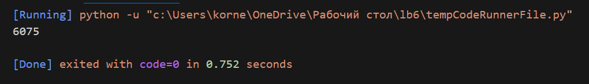
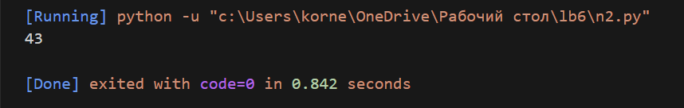
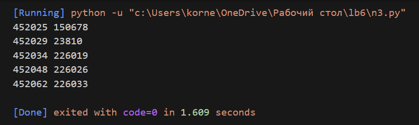

# Лабораторная работа №6
## Расчётные задачи. Itertools
### Задача 1.
Настя составляет 6-буквенные коды из букв Н, А, С, Т, Я. Каждая допустимая гласная буква может входить в код не более одного раза. Сколько кодов может составить Настя?
```python
import itertools
al = "НАСТЯ"
ar = itertools.product(al, repeat=6) 
a = []
for i in ar:
    a.append(list(i))
count = 0
for e in a:
    if e.count("А") <= 1 and e.count("Я") <= 1:
        count += 1
print(count)
```
### Результат программы.


### Задача 2.
Значение арифметического выражения  $16^{18} \cdot 4^{10} - 4^{6} - 16$ записали в системе счисления с основанием 4. Сколько цифр 3 содержится в этой записи?
```python
x = 16 ** 18 * 4 ** 10 - 4 ** 6 - 16
s = ''
while x != 0:
    s += str(x % 4)
    x //= 4
s = s[::-1]
print(s.count("3"))
```
### Результат программы.


### Задача 3.
Пусть M  — сумма минимального и максимального натуральных делителей целого числа, не считая единицы и самого числа. Если таких делителей у числа нет, то считаем значение M равным нулю. Найдите целые числа, большие 452 021, в порядке возрастания, такие, для которых значение M при делении на 7 даёт в остатке 3. Вывести первые 5 найденных чисел и соответствующие им значения M.
Формат вывода: для каждого из 5 таких найденных чисел в отдельной строке сначала выводится само число, затем  — значение M. Строки выводятся в порядке возрастания найденных чисел.
Например, для числа 20: M  =  2 + 10  =  12, остаток при делении на 7 не равен 3; для числа 21: M  =  3 + 7  =  10, остаток при делении на 7 равен 3.
```python
count = 0
num = 452021
while count < 5:
	num += 1
	mx = 0
	mn = num + 1 
	for i in range(2,int(num // 2)+1):
		if num % i == 0:
			mx = max(mx,i)
			mn = min(mn,i)
	M = mn + mx
	if (M != num + 1) and (M % 7 == 3):
		print(num, M)
		count += 1
```
### Результат программы.

